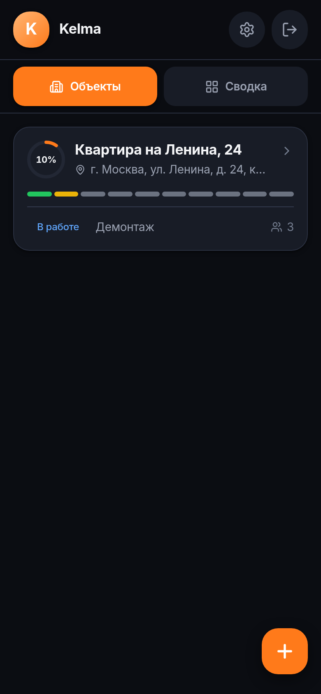
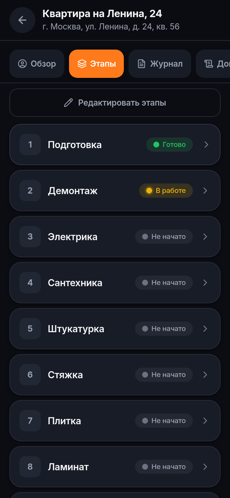
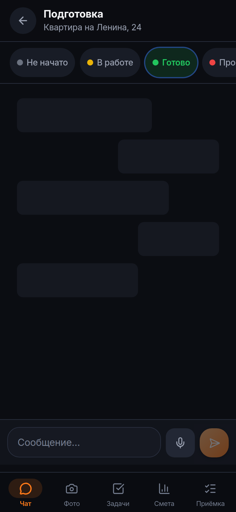
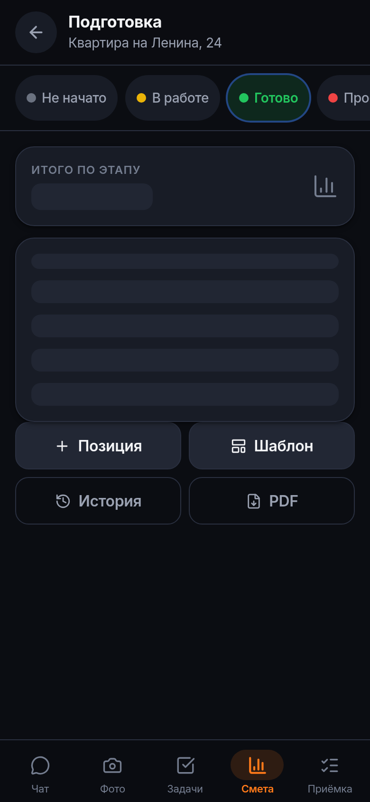
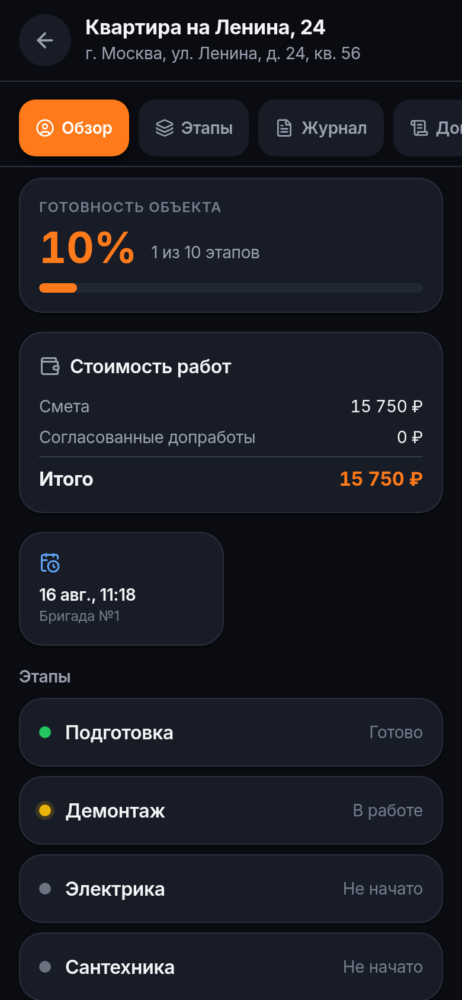
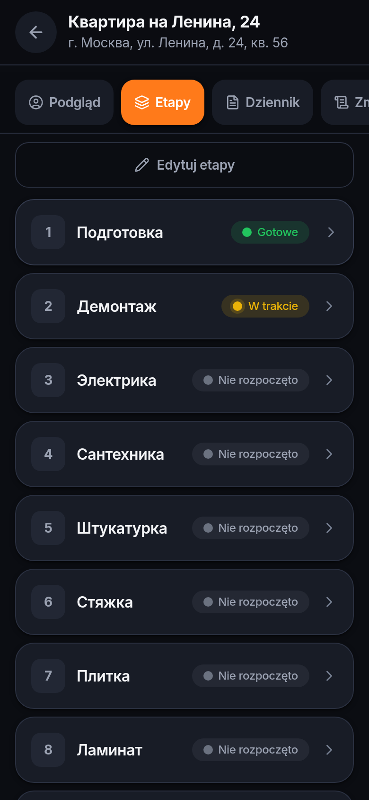

# Kelma

**A messenger for construction crews, organised around the building — not around dates.**

Group chats fail on a construction site. Three weeks into a renovation nobody can find which photo belonged to which stage, whether the client approved that extra work, or what the tiling was quoted at. Kelma keeps every message, photo, task, cost line and acceptance signature attached to a **project → stage**, so the history stays readable months later — when a warranty claim arrives and someone has to prove what was agreed.

Built mobile-first as an installable PWA: crews work from phones, often with one bar of signal and gloves on.

*Kelma* is the trowel — the tool everyone on the site already has in hand.

<p align="center">
  
  
  
</p>
<p align="center">
  
  
  
</p>

---

## What it does

**For the crew** — a chat per stage, photos stamped with date and GPS at capture time, tasks, shift clock-in, daily logs, material consumption against plan, defect lists, documents and floor plans with pins.

**For the foreman** — a dashboard across all projects, editable stage pipelines, estimates with change history and PDF export, reusable estimate templates, invitations by email or QR code.

**For the client** — a separate portal showing only what concerns them: readiness percentage, agreed cost, recent photos, next crew visit, and any change order awaiting their signature. No timesheets, no material margins.

**Acceptance is signed with a finger** on the phone. The signature is stored with the date, the amount and the account that signed — the evidence people actually argue about later.

## Speaks the language of the crew, not of the vendor

Six languages: Russian, English, Polish, Ukrainian, German, Czech. The interface picks the phone's language on first launch and can be switched per device.

This is the feature that decided the shape of the codebase. On a Polish site a Polish foreman routinely runs a Ukrainian crew, and everyone reads their own language while the project data stays shared. The two screenshots above are the same screen — the difference is only which phone opened it.

Keeping six hand-written dictionaries honest is the interesting part:

- `ru` is canonical and typed `as const`; a `DeepStringify` mapped type turns it into the `Dictionary` type, so a missing, extra or misnested key in any other locale is a **compile error**, not a blank label at runtime.
- A test walks every leaf path of all six dictionaries and asserts they match exactly and contain no empty strings.
- API errors travel as stable **codes**, not sentences — the server has no idea which language the caller reads. A test also asserts every server-side error code has a translation in all six locales, and that interpolation placeholders match across languages.

## Engineering notes

Things in here that were decided rather than defaulted:

**Realtime access is checked as carefully as REST.** Socket.io connections require a valid NextAuth session, and joining a stage room re-checks project membership against the database — knowing a stage id from a shared URL is not access. Removing someone from a project also evicts their live sockets immediately, so a dismissed subcontractor stops receiving the crew's chat at once instead of whenever they close the tab. ([`server.js`](kelma/server.js), [`socket-server.ts`](kelma/src/lib/socket-server.ts))

**Email invitations wait for a verified address.** Invitations are addressed by email, so honouring them at signup would let anyone register as `foreman@firm.com` and walk into that project. Signing up and using the app works immediately; email-addressed invitations convert to membership only after the address is proven. QR and link invitations are honoured at once — holding the link *is* the proof, and that flow has to keep working for a worker standing next to the foreman. ([`email-verification.ts`](kelma/src/lib/email-verification.ts))

**Locale detection can't break hydration.** The server always renders the default locale, so the client's first render must match it exactly; the real locale is applied in a layout effect — after hydration reconciles, before the browser paints. A phone set to Polish shows Polish on the first frame the user actually sees, with no mismatch warning and no flash of the wrong language. ([`locale-provider.tsx`](kelma/src/components/locale-provider.tsx))

**Photos are normalised before they touch the disk.** A phone camera produces 8–12 MB per shot and a crew takes dozens a day. Uploads are capped at 2048px (plans 3500px), EXIF orientation is baked into the pixels, and metadata — including the camera's GPS tags — is stripped; coordinates live in a database column where the app controls who sees them. A file sharp cannot decode is stored untouched rather than rejected: losing a photo taken on site is the worse outcome. ([`image.ts`](kelma/src/lib/image.ts))

**Startup refuses a misconfigured production.** A placeholder or short `NEXTAUTH_SECRET`, a missing `DATABASE_URL`, or an `http://` auth URL in production stop the process with an explanation. All three fail silently otherwise — and a plain-HTTP deployment quietly disables geolocation, push and offline mode while looking fine. ([`env-guard.js`](kelma/env-guard.js))

**Offline is assumed, not handled as an error.** Outgoing messages and photos queue in IndexedDB and flush when the connection returns. Basements exist.

**Privacy is implemented, not just promised.** One-click data export, real account deletion, error reports scrubbed of names, emails, phones and coordinates before they leave the process, and an opt-in consent dialog that gives "allow" and "decline" equal visual weight.

**Backups are scripted and the restore path was exercised** — database and uploaded files together, because a dump without files is a wall of broken thumbnails and files without a dump are anonymous JPEGs.

## Stack

Next.js 14 (App Router) · TypeScript · Tailwind · PostgreSQL + Prisma · NextAuth · Socket.io · sharp · PDFKit · Web Push · Sentry (optional) · Docker + Caddy · Vitest + Playwright

Roughly 20k lines across 162 TypeScript files, 25 database models, 56 API routes, 137 tests.

## Running it

```bash
cd kelma
cp .env.example .env
# generate your own session key — the app refuses to start in production without one
sed -i "s|^NEXTAUTH_SECRET=.*|NEXTAUTH_SECRET=\"$(openssl rand -base64 32)\"|" .env
docker compose up -d --build
docker compose exec app npx tsx prisma/seed.ts
```

Then open `http://localhost:3000`. Demo accounts (password `password123`):

| Account | Role |
| --- | --- |
| `prorab@kelma.dev` | admin / foreman |
| `master@kelma.dev` | worker |
| `client@kelma.dev` | client |

Production deployment with a domain and automatic HTTPS is described in [`kelma/DEPLOY.md`](kelma/DEPLOY.md); operational detail (backups, health checks, SMTP, push, Google Play packaging) lives in [`kelma/README.md`](kelma/README.md).

## Known limitations

Stated plainly, because a README that pretends otherwise is less useful:

- **Uploads live on a local disk volume**, so the app does not scale horizontally yet. Object storage is the next step when it matters.
- **The rate limiter keeps counters in process memory** — correct for a single instance, needs a shared store behind several.
- **The legal pages are written against the app's real behaviour but are not a substitute for a lawyer** before taking paying customers, particularly for the GDPR duties that come with EU deployment.
- **No billing.** There is no subscription or payment path in the product.

---

<sub>`smc_bot_v2.7_clean_visual.py` at the repository root is an unrelated earlier Telegram/Binance experiment kept for history; everything above lives in [`kelma/`](kelma).</sub>
