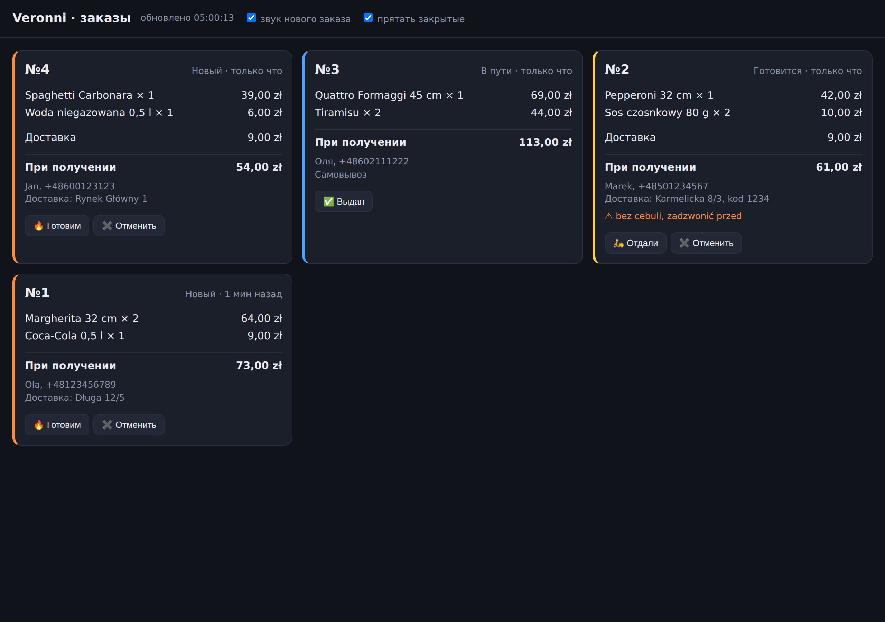

# Veronni — приём заказов в Telegram обычным текстом

Бот, который понимает **«две маргариты 32 и колу, доставка на Długa 12/5»** одним сообщением: разбирает состав, считает сумму, спрашивает недостающее, оформляет заказ и отправляет талон на кухню. Оплата при получении.

Не дерево кнопок «Пицца → Размер → Начинка → Назад». Клиент пишет как человек — бот отвечает как человек.

<p align="center">
  
</p>

---

## ⚠️ Меню в репозитории — заглушка

Настоящего меню Veronni здесь нет. В [`prisma/menu-data.ts`](prisma/menu-data.ts) лежит типовая карта краковской пиццерии с правдоподобными ценами — 36 позиций.

**Перед показом заведению замените этот файл на их реальное меню и выполните `npm run seed`.** Больше править нигде не нужно: агент читает меню из базы. Демо на настоящих названиях и настоящих ценах убеждает несравнимо сильнее.

---

## Что умеет

- **Заказ обычным текстом.** «Что-нибудь острое и без мяса», «то же, что вчера, но большую» — разбирает сам.
- **Отвечает на языке клиента.** Написали по-польски — ответит по-польски. Русский, украинский, английский тоже.
- **Уточняет ровно то, чего не хватает.** Не назвали размер — спросит размер. Не назвали адрес — спросит адрес. По одному вопросу за раз.
- **Талон на кухню в Telegram** с кнопками «Готовим / Отдали курьеру / Выдан». Нажатие меняет статус и уведомляет клиента.
- **Живая админка заказов** — открывается в браузере на кухонном экране, обновляется сама, пикает на новый заказ.
- **Помнит постоянного клиента**: имя, телефон и адрес не нужно диктовать заново.

## Чего он намеренно не делает

- **Не считает деньги сам.** Все суммы, стоимость доставки и итог считает код по ценам из базы. Модель получает готовые числа и обязана называть только их — в промпте это отдельное правило. Языковая модель, складывающая цены в уме, рано или поздно ошибётся на десятку, и это будет ошибка в чеке клиента.
- **Не оформляет заказ «на честном слове».** `place_order` — это не команда, а запрос: код проверяет корзину, имя, телефон (по формату), адрес для доставки, минимальную сумму и часы работы. Не хватает чего-то — инструмент отказывает и объясняет чем, агент идёт спрашивать. Модель не может это обойти, даже если очень захочет.
- **Не выдумывает блюда.** id позиций берутся только из меню; неизвестный id не добавляется в корзину, а возвращается агенту как ошибка.
- **Не принимает оплату онлайн.** Только при получении — наличными или картой курьеру.

## Как устроено

```
Telegram → grammY → цикл агента (Claude + инструменты) → SQLite
                          ↓                                  ↓
                   талон на кухню                    админка на :4321
```

Пять инструментов: `add_to_cart`, `remove_from_cart`, `clear_cart`, `set_order_details`, `place_order`. Цикл в [`src/agent/run.ts`](src/agent/run.ts) написан руками, а не через tool runner, по двум причинам: состояние диалога после каждого хода сохраняется в базу (перезапуск бота не роняет наполовину собранный заказ), а факт создания заказа надо перехватить, чтобы отправить талон.

Постоянная часть промпта — инструкции и меню — уходит в кэш Anthropic; изменчивое (время, корзина, собранные данные) идёт отдельным блоком после точки кэширования, иначе кэш ломался бы на каждом сообщении.

Деньги везде целые числа в грошах. `0.1 + 0.2` в плавающей точке даёт `0.30000000000000004`, и однажды это вылезет в чеке.

## Запуск

Нужен Node 20+.

### Что подготовить

1. **Токен бота** — в Telegram напишите [@BotFather](https://t.me/BotFather) → `/newbot` → получите строку вида `12345:AAH...`
2. **Ключ Anthropic** — [console.anthropic.com](https://console.anthropic.com) → API Keys. Разговор из десятка сообщений стоит около одного цента.
3. **Чат кухни** — создайте группу в Telegram, добавьте туда бота, напишите в неё что угодно, откройте `https://api.telegram.org/bot<ВАШ_ТОКЕН>/getUpdates` и возьмите `chat.id` (у групп он отрицательный).

### Windows, PowerShell

```powershell
cd veronni
npm install
Copy-Item .env.example .env
notepad .env      # вписать 4 значения: токен, ключ, id чата кухни, пароль админки
npm run setup     # создать базу и залить меню
npm start
```

### macOS / Linux

```bash
cd veronni && npm install && cp .env.example .env
$EDITOR .env
npm run setup && npm start
```

Админка — `http://localhost:4321`, пароль из `ADMIN_PASSWORD`.

### Проверить агента без Telegram

Нужен только `ANTHROPIC_API_KEY`:

```bash
npm run chat
```

Разговор идёт прямо в терминале, талон на кухню печатается там же. Удобно проверять формулировки и показывать логику, не заводя бота.

## Тесты

```bash
npm test        # 41 тест: деньги, корзина, проверки заказа, цикл агента
npm run typecheck
```

Цикл агента проверяется на заглушке модели — сценарий из заранее заданных ответов вместо сети. Проверяется главное: что суммы приходят из кода, что выдуманный id не попадает в корзину, что заказ без телефона не оформляется, что второй `place_order` не создаёт дубль и что модель не может зациклиться на инструментах.

## Настройки

Всё в `.env` — цены доставки, часы работы, зона, время готовности, адрес и телефон заведения. Суммы в грошах: `900` = 9,00 zł.

| Переменная | Что делает |
| --- | --- |
| `OPENS_AT` / `CLOSES_AT` | Часы кухни. Вне них заказ не оформится. Работаете за полночь — поставьте `11` и `2`. |
| `DELIVERY_FEE_GR` | Стоимость доставки |
| `FREE_DELIVERY_FROM_GR` | С какой суммы доставка бесплатна |
| `MIN_ORDER_GR` | Минимальная сумма заказа на доставку |
| `TIME_ZONE` | Часовой пояс заведения — часы считаются по нему, а не по времени сервера |
| `CLAUDE_MODEL` | По умолчанию `claude-opus-5` |

## Ограничения

Честно, потому что их видно при первом же серьёзном использовании:

- **База — SQLite, один процесс.** Для одной пиццерии этого достаточно с большим запасом; для сети точек нужен Postgres.
- **Заказ виден только в Telegram и в админке.** Интеграции с кассой или системой учёта нет.
- **Приём только текстом.** Голосовые сообщения бот вежливо отклоняет.
- **Персональные данные** (имя, телефон, адрес) лежат в базе без срока хранения и без страницы политики. Перед настоящим запуском в ЕС это надо закрыть.
